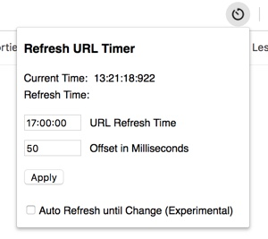

# Refresh URL Timer - Chrome Extension
Chrome Extension the schedules the refreshing of a URL at a certain time

Features:
* Refreshing the current open Chrome Tab to a predefined time
* Defining an Offset which subtracts a specified number of milliseconds from the predefined time
* Experimental: Auto-Refresh the page (after the predefined time) as long as changes in the body of the opened website occur

## Installation
Prerequirements: This Extension only works in Google Chromer Browser.

1. Open the link `chrome://extensions/` in Chrome Browser 
2. Activate `Developer Mode` and click on `Load Extracted Extension`
3. Choose the folder in which this `README.md` is located to load the Plugin into your Browser

Congratulations! The Plugin is now visible in your Browser.

## HowTo

### Offset
The Offset defines a number in milliseconds which get subtracted from the predefined time. By using this feature, you can consider e.g. latencies in your network. Therefore, you can schedule sending the request a bit earlier so that it hits the server at the predefined time.

Tip: User Chrome Developer Tools Network Tracing to calculate the best Offset for your specific use case.

### Auto-Refresh
This feature is still in experimental mode and does not work on every page. When using, be aware of the following:
* Make sure to set the you do not set the refreshing time too early. There might be a chance that you hit the server to hard and you get blocked.
* The Auto-Refresh waits until the page is fully loaded, checks if the content of the body has changed and refreshes the page if this is not the case. It stops as soon as a change occurred (even 1 byte).
* Since the feature waits until the page is fully loaded, the time interval between the refreshes depends highly on the speed of the page but will usually be between 2-5 seconds.

If you want to hit the server at a very specific time, this feature might be not right for you because of this 2-5 seconds time delay between the old and new refresh.